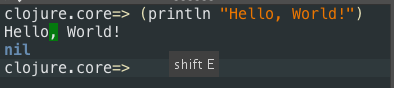

# A Gentle Introduction to Clojure Through Turtles


### Objectives:

1. Have fun with turtles
2. Learn about programming
3. Learn about Clojure


## Hello World

Open Nightcode if it's not already open:

```bash
cd ~/Downloads/
java -jar nightcode-1.3.2-standalone.jar
```

In the lower left pane, type 

```clojure
(println "Hello, World!")
```

You should see this:



This is the traditional first program you write in any language. Congratulations, you've just written your first program in Clojure! 

>(Don't worry about the fact that it says "nil" right after "Hello, World!". We'll explain that later.)

## Turtles

Something called "turtle graphics" is a very common way to teach programming to beginners, because it's fun and provides immediate visual feedback.

Imagine a little robot turtle on a piece of paper. It has a pen connected to its belly, with the tip of the pen touching the paper. You can tell it to move forward, left or right, and it will leave a mark.

If you haven't already, go to Nightcode and import the "welcometoclojurebridge" project that we downloaded (by using the `git clone` command) during the setup time.

Now open the `walk.clj` file, whose full name is `welcometoclojurebridge/src/clojurebridge_turtle/walk`.

Now click the "Run with REPL" button in the lower right hand pane. You'll have to wait about 30 seconds until it prints several lines of output and gives you a REPL prompt where you can type.

At this point, click the "Reload" button, and it should give you a window with a turtle in it (a little triangle).

Into the lower right pane of Nightcode, type in the following commands:

```clojure
(forward 50)
(right 45)
(forward 50)
```

Pretty cool, right? 

>But what's all that text that gets output after every command you run, like `{:trinity {:length 50}}` ? Don't worry about that -- we'll explain it later.

If you want to undo something you just did, you can use `undo`

```clojure
(forward 50)
(right 45)
(forward 50)
(undo)
```

If you want to clear away all your lines, use `clean`:

```clojure
(forward 50)
(right 45)
(forward 50)
(clean)
```

And if you want to clear away all the lines and send the turtle back to its starting place, use `init`:

```clojure
(forward 50)
(right 45)
(forward 50)
(init)
```

Ok, let's play with some turtles! Make sure to try different distances for `forward` and different angles for `left` and `right`. See if you can make some interesting shapes and patterns!

### You may be asking yourself at this point, what's up with the parentheses?

Good question.

All commands in Clojure are surrounded by parentheses, and the first thing after the opening parenthesis is always the name of the command, also called a "function". 

If the function needs what is called an "argument" -- like a distance for a turtle to travel -- then that goes after the name of the function.

## Math

## Def

## Defn
 
## More fun with turtles (dotimes, etc.)


