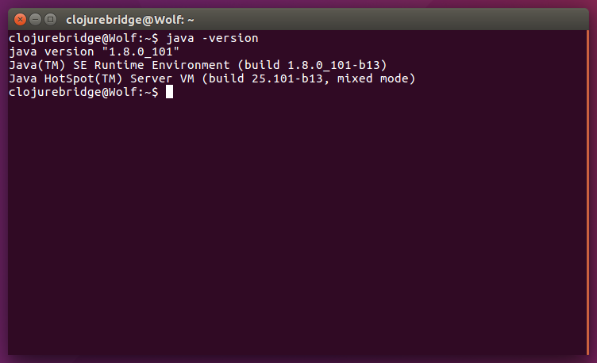
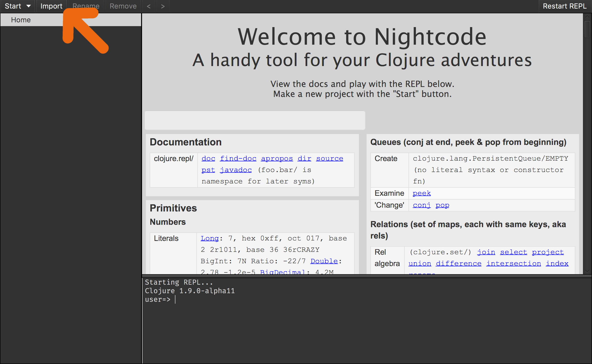

Ubuntu Setup
==========

* Start a terminal
* Install Git
* Configure Git
* Install Java
* Install Leiningen
* Install Nightcode
* Test your setup

## Starting a terminal

For these instructions, and for much of the class, you will need to have a terminal, or command line, open. This is a text-based interface to talk to your computer, and you can open it by clicking "Dash Home" and typing `Terminal`. You can also open a terminal at any time by pressing `CTRL-ALT-T`. If you have never used the terminal before, you may want to spend some time [reading up on command-line basics](http://blog.teamtreehouse.com/command-line-basics).

Go ahead and open your terminal now. It should look something like this:


The prompt (where you will type your commands) may look different: it usually shows the computer name and user name, as well as the folder or directory you are currently in.

For the rest of this setup, I will tell you to run commands in your terminal. When I say that, I mean "type the command into the terminal and press the Return key."

## Installing Git

See if you already have Git installed with `git version`.
If the `git` command is not found, install it with this command in the terminal:

```bash
sudo apt-get install git
```

## Configure Git

If you've used Git before then you should already have user.name and user.email configured.
Otherwise, type this in the terminal:

```bash
git config --global user.name "Your Actual Name"
git config --global user.email "Your Actual Email"
```

TIP: Use the same email address for git, github, and ssh.

Verify by typing this in the terminal:

`git config --get user.name`
Expected result:
`your name`

`git config --get user.email`
Expected result:
`your email address`


## Install Java

Ubuntu comes with OpenJDK installed.
However, newer versions of Nightcode have a problem to run on OpenJDK.
Oracle JDK 8 is the best Java to go over our materials.

```bash
sudo add-apt-repository ppa:webupd8team/java
sudo apt-get update
sudo apt-get install oracle-java8-installer
(follow the instruction)
```

At this moment, you have installed Oracle JDK 8 on your Ubuntu box.
There's one more step to use newly installed Oracle JDK 8.

```bash
sudo update-alternatives --config java
(choose /usr/lib/jvm/java-8-oracle/jre/bin/java)
```

Run `java -version` in your terminal. You should see something like this in your terminal:



The minor version may differ from what you see above; however, it must be `1.8.0`.
Also, you should see `Java(TM) SE Runtime Environment`.


Alternatively, you may download Java Development Kit (JDK) from
[Java SE Downloads](http://www.oracle.com/technetwork/java/javase/downloads/index.html).
In this case, you need to set `JAVA_HOME` and `PATH` environment variables after extracting the archive.


## Install Leiningen

Leiningen is a tool used on the command line to manage Clojure projects.

Go to the [Leiningen website](http://leiningen.org/). You will see a link to the `lein` script under the "Install" heading. Right-click that link and choose "Save Link As...". Save it in your Downloads directory.


After that, run the following commands in your terminal. You will be prompted to enter your password.

```
sudo mkdir -p /usr/local/bin/
sudo mv ~/Downloads/lein* /usr/local/bin/lein
sudo chmod a+x /usr/local/bin/lein
export PATH=$PATH:/usr/local/bin
```

After you run the above commands, run the `lein version` command. It should take a while to run, as it will download some resources it needs the first time. If it completes successfully, you are golden! If not, ask an instructor for help.

## Install Nightcode

Go to the [Nightcode releases site](http://github.com/oakes/Nightcode/releases).
On the page there, you should see version numbers and links to download specific version of Nightcode, for example, Nightcode-2.3.3.jar.
Click the link ending in `.jar` and you will download a file, `Nightcode-x.y.z.jar`.

> Don't download platform specific binary releases.
> Use jar archive.
> Jar archive is much easier to get started.

Once the download finished, we want to start the editor.
To startup, go into your Downloads folder (or wherever you save files from your browser) and run the Nightcode-x.y.z.jar file using `java` command.

Open a terminal and run the following commands:

```bash
cd ~/Downloads/
java -jar Nightcode-2.3.3.jar
```


## Testing your setup

You have set up Java, Leiningen, Nightcode, and Git on your computer--all the tools you will need for this course. Before starting, we need to test them out.

#### Testing Leiningen

Open a new terminal and run the following command:

```bash
lein new myproject
```

This will create a new project, `myproject`, which has files to form a Clojure project.
Normally, Clojure code exists within such Clojure project.

Run following commands:

```bash
cd myproject
lein repl
```

This may take long to start up for the first time.
Leiningen downloads libraries it needs to run Clojure.
When Leiningen starts, you'll see `user=>` prompt on your terminal.


Now, you are ready to use __REPL__, which we learn about soon.
It's a special terminal for Clojure.

At the REPL prompt, type `(+ 1 1)` and press Return. Did you get the answer `2` back? Great!

Your leiningen install looks good. For now, press the Control button and D button on your keyboard together (abbreviated as Ctrl+D). This should take you out of the Clojure REPL and back to your normal terminal prompt. Then, the terminal will show you the following message: `user=> Bye for now!`


#### Cloning out github repository

Open another terminal and run the following command:

```bash
git clone https://github.com/ClojureBridge/welcometoclojurebridge
```

This will clone `welcometoclojurebridge` repository which includes sample Clojure apps.
Your terminal should look similar to this picture:


Once it finishes, type following commands on the same terminal.

```bash
cd welcometoclojurebridge
ls
```

You'll see the list of directories/files like this:

```
README.md       outline         project.clj     resources       src
```

#### Testing Nightcode

If Nightcode isn't started yet or closed, open it by typing the command on terminal:

```bash
java -jar Nightcode-2.3.3.jar
```

At the bottom right of the screen, type `(+ 1 1)` into the window. It should look like the following image:


If you see the result, 2, that worked, great!


### Testing apps

Now we will open and run the sample Clojure apps in Nightcode.
On the top left corner, click "Import" then find the directory,
`welcometoclojurebridge`, which was created when you ran
`git clone` command. Click "Open."
In the project directory tree on the left, click on `src` - `welcometoclojurebridge` - `core.clj`. The `core.clj` file will be opened on the right side.
This is a Clojure program.




The next step is to run the code shown in the window.
Click "Run with REPL" on the bottom.
It may take a while.
Eventually, REPL will start and show a prompt, `user=>`.
Once, you see the prompt, click "Reload" button.


You should see a fun welcome message.


Let's try one more sample.
In the directory tree on the left, click on
`welcometoclojurebridge` - `src` - `clojurebridge-turtle` -
`walk.clj`. The `walk.clj` file will open on the right side.
Like we did before, click "Reload" button.


An initial image of the turtles app should pop up.
A small triangle on the center is the *turtle*.


Type `(forward 40)` on the repl at the bottom of the window.
You should see the turtle moved upword:


#### Success!

Congratulations! You have opened and run your first Clojure apps, and
your install and setup are all completed!

If you want to know what the turtle (*a small triangle*) can do,
see [Turtle App API](https://github.com/ClojureBridge/welcometoclojurebridge/blob/master/outline/TURTLE.md) and
[How to Walk Turtles](https://github.com/ClojureBridge/welcometoclojurebridge/blob/master/outline/TURTLE-SAMPLES.md) for more information.
